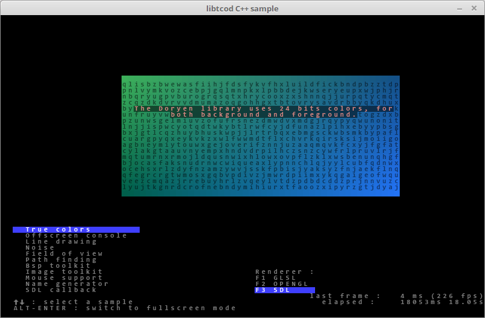
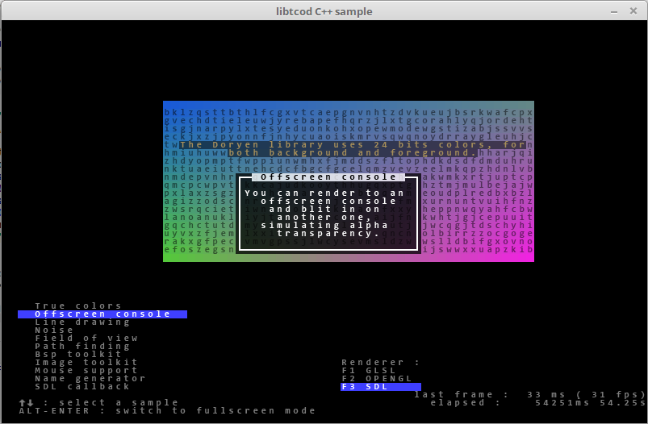
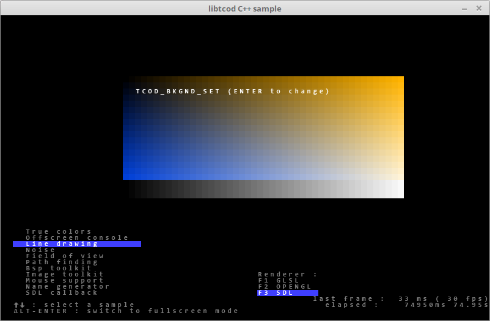
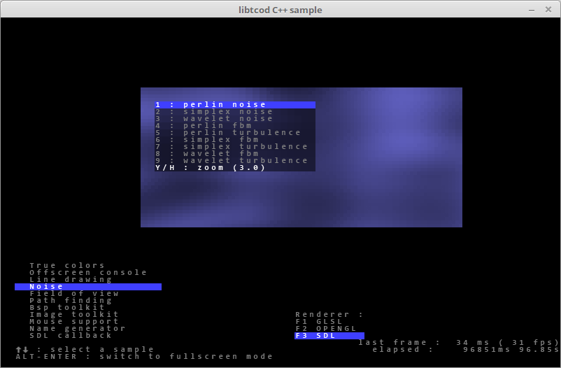
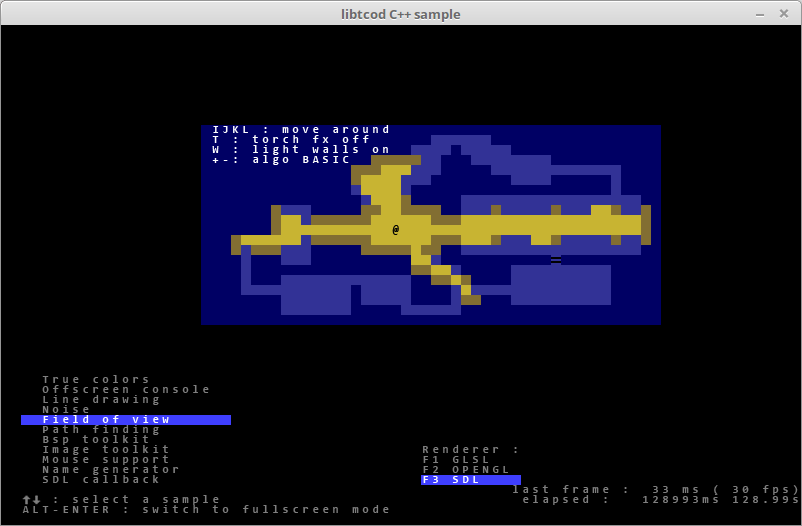
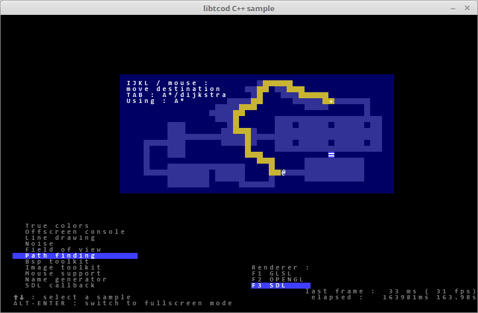
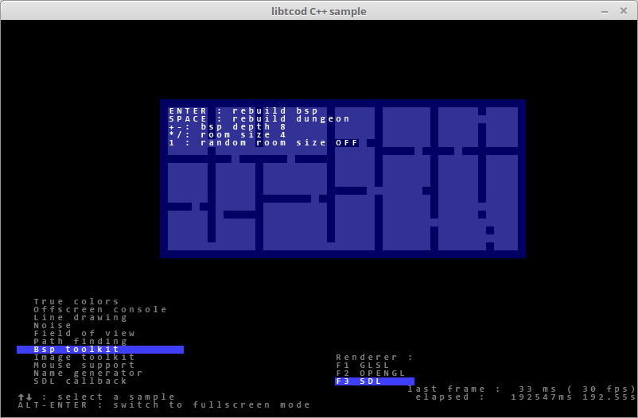
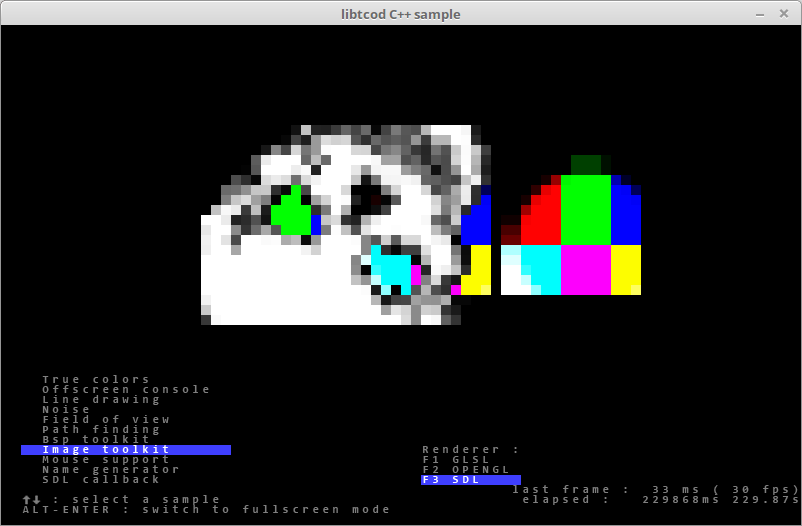
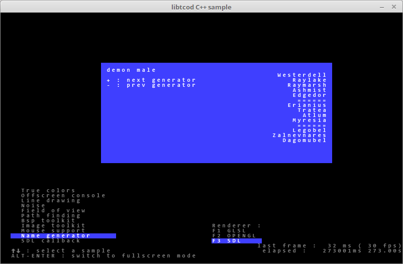
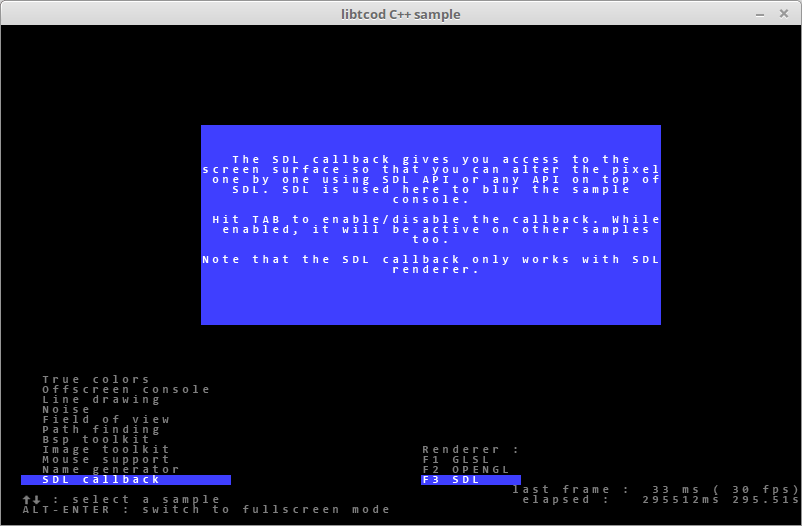

### Doryen Based in Libtcod 1.5.1

### Features

##### Keyboard Input and Mouse Input

The keyboard module supports both turn-by-turn and real time games.

##### True color console

Don’t limit yourself to monochrome or 16 color roguelikes. 
True colors create a whole world of new visual possibilities.

##### Antialiased bitmap font support

Antialiasing makes it possible to have better looking fonts, 
even when you’re using characters as small as 8×8.

##### Sub-cell resolution & SDL callback

Use a few special characters within a font to simulate pixels half 
the size of a console cell or directly apply SDL post-processing on 
the image.

##### High quality pseudo-random number generation

Using Mersenne twister algorithm.

##### BMP and PNG image support

You can blit images onto your console background.

##### Perlin noise toolkit

Support for Perlin, simplex and wavelet noises.

##### Heightmap toolkit

Tools to generate heightmaps.

##### A field of view toolkit

Supported algorithms:

- Basic raycasting.
- Recursive shadowcasting.
- Diamond raycasting.
- Precise permissive fov.
- Restrictive shadowcasting a.k.a. MRPAS.

##### Path finding toolkit

Using A* or Dijkstra algorithms, with either a builtin map data structure 
or your own internal data structure through function callbacks.

##### BSP toolkit

For regions, cities, dungeons building.

### Compiling from source

##### Requirements

- CMake Version >= 3.15
- SDL Version === 1.2.15
- SDL Version >= 2.0.4

##### Commands

You can clone with Git via the GitHub repository.

    git clone --recursive --depth=1 https://github.com/Andres6936/Doryen.git
    cd Doryen && mkdir Build
    cd Build && cmake ..
    make

###### All screenshots come from the Doryen sample source code.

Click for See Screenshots

    

        
        
        
        
        
        
        
        
        
        
        
    

